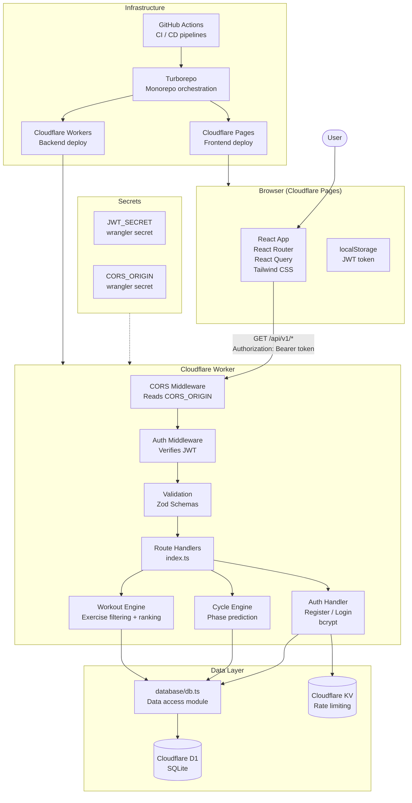
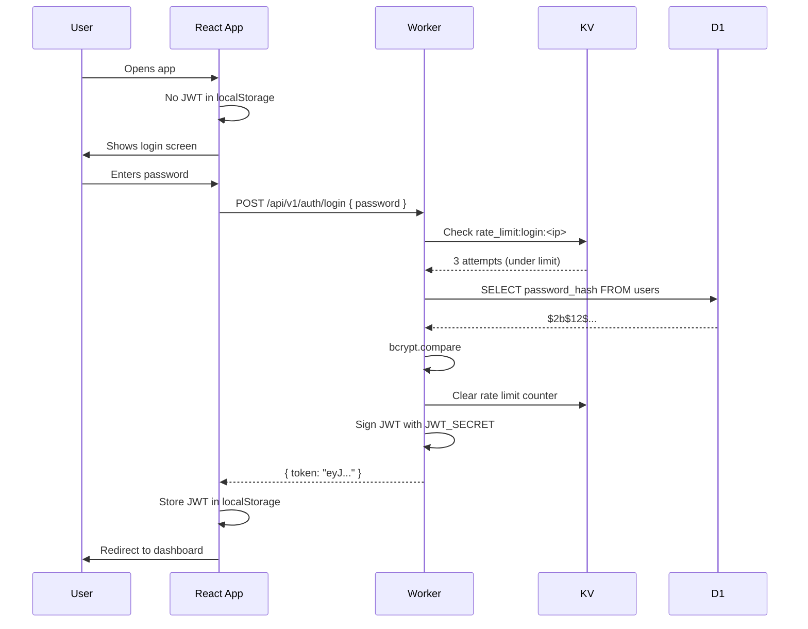
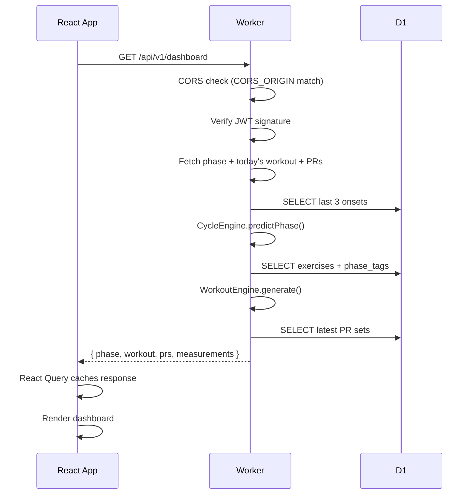
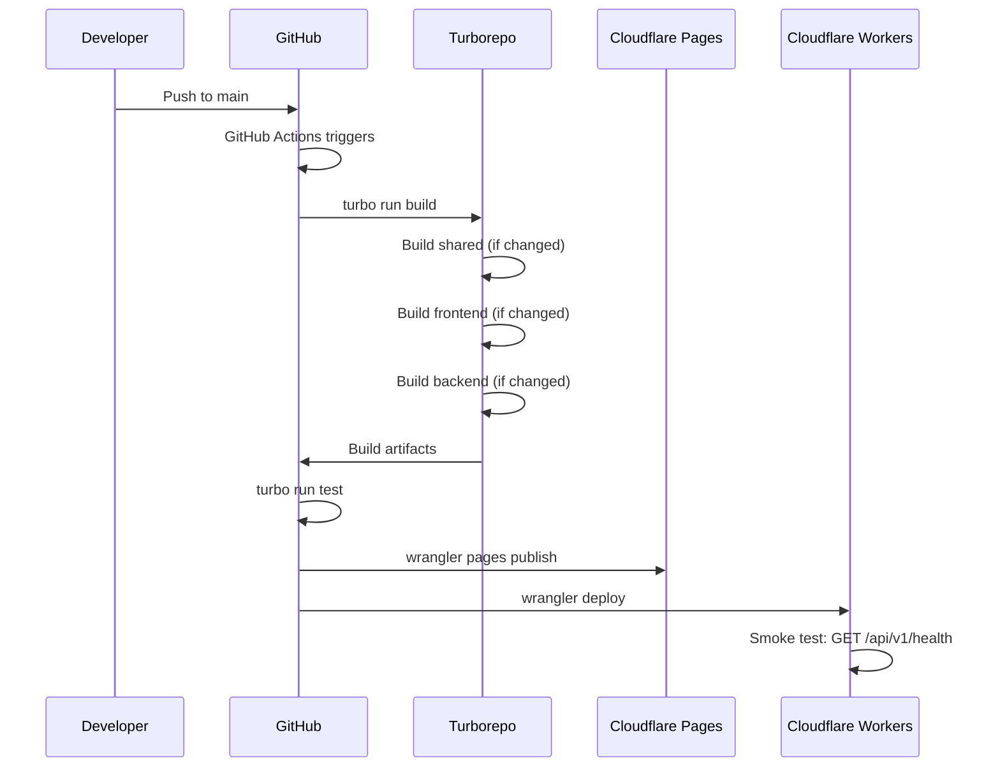

# Architecture Diagram

```mermaid
graph TB
    subgraph Browser["Browser (Cloudflare Pages)"]
        REACT["React App
              React Router
              React Query
              Tailwind CSS"]
        LOCAL["localStorage
              JWT token"]
    end

    subgraph WORKER["Cloudflare Worker"]
        CORS["CORS Middleware
              Reads CORS_ORIGIN"]
        AUTH["Auth Middleware
              Verifies JWT"]
        VALIDATE["Validation
              Zod Schemas"]
        ROUTES["Route Handlers
              index.ts"]
        CYCLE_ENG["Cycle Engine
              Phase prediction"]
        WORKOUT_ENG["Workout Engine
              Exercise filtering + ranking"]
        AUTH_HANDLER["Auth Handler
              Register / Login
              bcrypt"]
    end

    subgraph DATA["Data Layer"]
        DB["database/db.ts
              Data access module"]
        D1[(Cloudflare D1
              SQLite)]
        KV[(Cloudflare KV
              Rate limiting)]
    end

    subgraph INFRA["Infrastructure"]
        CF_PAGES["Cloudflare Pages
              Frontend deploy"]
        CF_WORKER["Cloudflare Workers
              Backend deploy"]
        TURBO["Turborepo
              Monorepo orchestration"]
        CI["GitHub Actions
              CI / CD pipelines"]
    end

    subgraph SECRETS["Secrets"]
        JWT_SEC["JWT_SECRET
              wrangler secret"]
        CORS_ORIGIN["CORS_ORIGIN
              wrangler secret"]
    end

    USER(["User"]) --> REACT

    REACT -- "GET /api/v1/*
              Authorization: Bearer token" --> CORS
    CORS --> AUTH
    AUTH --> VALIDATE
    VALIDATE --> ROUTES

    ROUTES --> AUTH_HANDLER
    ROUTES --> CYCLE_ENG
    ROUTES --> WORKOUT_ENG

    AUTH_HANDLER --> DB --> D1
    AUTH_HANDLER --> KV
    CYCLE_ENG --> DB
    WORKOUT_ENG --> DB

    SECRETS -.-> WORKER

    CI --> TURBO
    TURBO --> CF_PAGES
    TURBO --> CF_WORKER
    CF_PAGES --> Browser
    CF_WORKER --> WORKER
```

## Request Flow (Login)

```mermaid
sequenceDiagram
    participant U as User
    participant R as React App
    participant W as Worker
    participant K as KV
    participant D as D1

    U->>R: Opens app
    R->>R: No JWT in localStorage
    R->>U: Shows login screen
    U->>R: Enters password
    R->>W: POST /api/v1/auth/login { password }
    W->>K: Check rate_limit:login:<ip>
    K-->>W: 3 attempts (under limit)
    W->>D: SELECT password_hash FROM users
    D-->>W: $2b$12$...
    W->>W: bcrypt.compare
    W->>K: Clear rate limit counter
    W->>W: Sign JWT with JWT_SECRET
    W-->>R: { token: "eyJ..." }
    R->>R: Store JWT in localStorage
    R->>U: Redirect to dashboard
```

## Request Flow (Protected API Call)

```mermaid
sequenceDiagram
    participant R as React App
    participant W as Worker
    participant D as D1

    R->>W: GET /api/v1/dashboard
    W->>W: CORS check (CORS_ORIGIN match)
    W->>W: Verify JWT signature
    W->>W: Fetch phase + today's workout + PRs
    W->>D: SELECT last 3 onsets
    W->>W: CycleEngine.predictPhase()
    W->>D: SELECT exercises + phase_tags
    W->>W: WorkoutEngine.generate()
    W->>D: SELECT latest PR sets
    W-->>R: { phase, workout, prs, measurements }
    R->>R: React Query caches response
    R->>R: Render dashboard
```

## Deployment Flow

```mermaid
sequenceDiagram
    participant Dev as Developer
    participant GH as GitHub
    participant T as Turborepo
    participant P as Cloudflare Pages
    participant W as Cloudflare Workers

    Dev->>GH: Push to main
    GH->>GH: GitHub Actions triggers
    GH->>T: turbo run build
    T->>T: Build shared (if changed)
    T->>T: Build frontend (if changed)
    T->>T: Build backend (if changed)
    T->>GH: Build artifacts
    GH->>GH: turbo run test
    GH->>P: wrangler pages publish
    GH->>W: wrangler deploy
    W->>W: Smoke test: GET /api/v1/health
```
